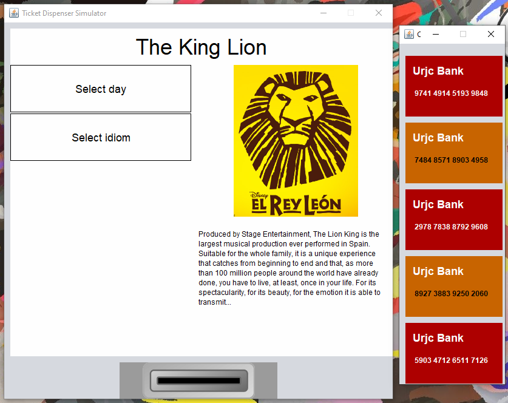
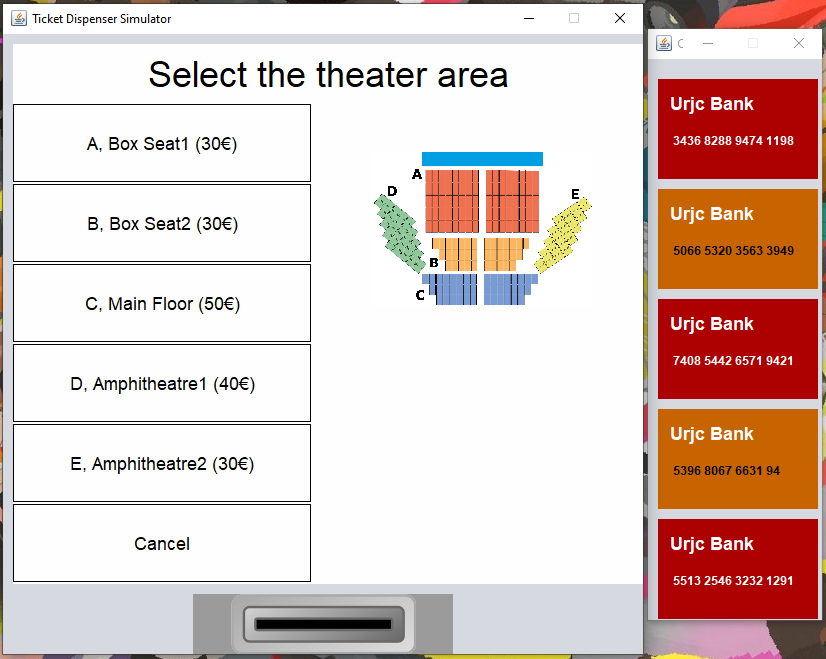
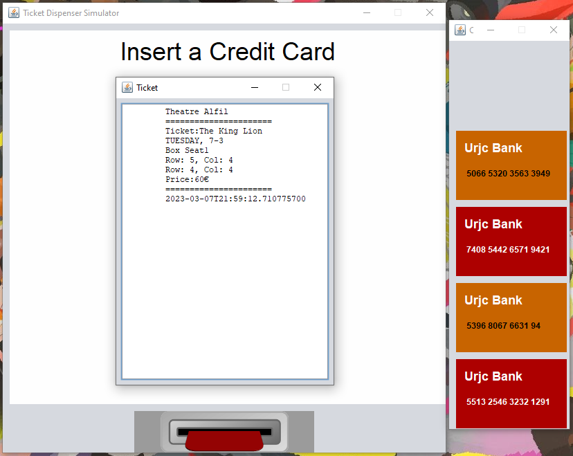

# TheaterTicketDispenser

## :scroll: Table of Contents

* [Introduction](#performing_arts-introduction)
  * [Start-up the application](#rocket-start-up-the-application)
* [Design](#black_nib-design)
  * [Class Diagrams](#european_post_office-class-diagrams)
  * [Sequence Diagrams](#chart_with_upwards_trend-sequence-diagrams)
  * [Activity Diagrams](#running-activity-diagram)
* [Implementation](#floppy_disk-implementation)
  * [About the page](#bookmark_tabs-about-the-application)
  * [Preview](#electric_plug-preview)

## :performing_arts: Introduction

It is the final project of **OOP course**, create all the logic referent to a Theater Ticket Dispenser.

The practice is composed of its **design** and its **implementation** (about the same topic but indepent).

The GUI was carried out by the teachers of the course.

### :rocket: Start-up the application

First, clone the repository and cd to the project.

```
git clone https://github.com/KandV008/Theater-Ticket-Dispenser.git
cd Theater-Ticket-Dispenser
```
Second, access to cd where is the main app application and run the project.
```
cd TheaterApp/src/theaterapp
javac TheaterApp.java
```


***

## :black_nib: Design

### :european_post_office: Class Diagrams


 *Figure 1 - Main Diagram*


 *Figure 2 - Sale Ticket Diagram*


*Figure 3 - Relation with File Diagram*


*Figure 4 - Relation with Packages Diagram*

### :chart_with_upwards_trend: Sequence Diagrams


*Figure 5 - Program Starts Diagram*


*Figure 6 - Ticket Sales Diagram*

### :running: Activity Diagram


*Figure 7 - Text Traduction Diagram*


*Figure 8 - Sale Process Diagram*

***

## :floppy_disk: Implementation

### :bookmark_tabs: About the application

It is a theater ticket dispenser software, where you can buy ticket for a perfomance, at the moment.

The application manages all the information about the theatre and their zones. 

Add the possibility to add more options, for example, buy binoculars or  librettos.

Allow to change the language to **spanish**, **basque**, **catalan**, **galician** or **english**.

#### :wrench: Technical Features

* JDK 8
* Oriented to Spaniards, Galicians, Basques, Catalans and English.

### :electric_plug: Preview



*Figure 9 - Menu Screen*


*Figure 10 - Language Selection Screen*


*Figure 11 - Day Selection Screen*



*Figure 12 - Theater Area Selection Screen*


*Figure 13 - Theater Seats Selection Screen*


*Figure 14 - Payment Screen*



*Figure 15 - Ticket Screen*
